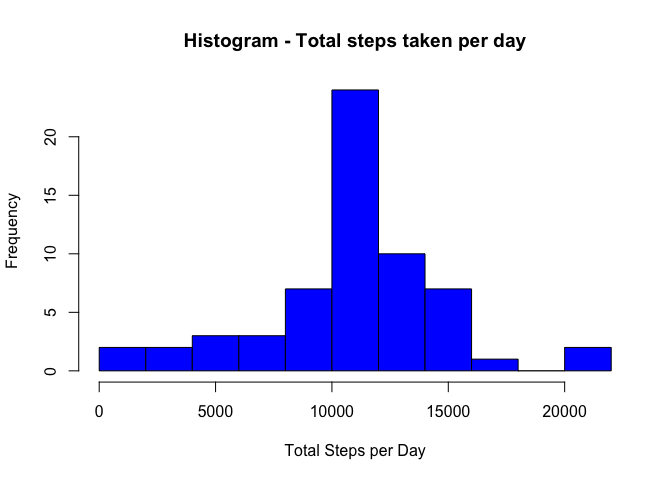

# Reproducible Research: Peer Assessment 1


## Loading and preprocessing the data

The code responsible of reading the data and performing the preprocessing is:


```r
activities <- read.csv("activity.csv")
activities$date = as.Date(activities$date, "%Y-%m-%d")
```

## What is mean total number of steps taken per day?
From the provided data, the steps are aggregated per day, and the histogram shows the frequency of the steps taken per day.


```r
stepsPerDay<-aggregate(steps~date,data=activities,sum)
hist(stepsPerDay$steps, col = "blue", xlab = "Total Steps per Day", ylab = "Frequency", 
     main = "Histogram - Total steps taken per day",breaks=10)
```

 

The mean and median of the steps taken per day are calculated:


```r
meanSteps<-mean(stepsPerDay$steps)
medianSteps<-median(stepsPerDay$steps)
```

The resulting mean is 10766 steps and the median is 10765 steps.

## What is the average daily activity pattern?

First, the data are aggregated per intervals, computing the mean for each interval.

```r
stepsPerInterval<-aggregate(steps~interval,data=activities,mean)
```

Then, a time series plot is made for show the pattern of the average daily activity pattern

```r
library(ggplot2)
library(scales)
ggplot(stepsPerInterval, aes(interval,steps)) + geom_line() 
```

 


```r
maxInterval <- with(stepsPerInterval, {
  interval[which.max(steps)]
})
```
Also, the 5-minute interval containing the maximum number of steps has been calculated, resulting on being the interval 835

## Imputing missing values

Note that there are a number of days/intervals where there are missing values (coded as NA). 


```r
summary(activities)
```

```
##      steps             date               interval     
##  Min.   :  0.00   Min.   :2012-10-01   Min.   :   0.0  
##  1st Qu.:  0.00   1st Qu.:2012-10-16   1st Qu.: 588.8  
##  Median :  0.00   Median :2012-10-31   Median :1177.5  
##  Mean   : 37.38   Mean   :2012-10-31   Mean   :1177.5  
##  3rd Qu.: 12.00   3rd Qu.:2012-11-15   3rd Qu.:1766.2  
##  Max.   :806.00   Max.   :2012-11-30   Max.   :2355.0  
##  NA's   :2304
```


```r
numberOfMissing<-sum(is.na(activities$steps))
```

For the given data, the number of missing values is 2304

In order to avoid introducing bias into some calculations or summaries of the data a strategy for filling in all of the missing values in the dataset has been designed. The proposed strategy is to use the mean for the 5-minute interval having a missing value.


```r
completedActivities <- activities
completedActivities[is.na(completedActivities$steps), 'steps'] <- 
  apply(completedActivities[is.na(completedActivities$steps), ], 1, 
        function(x, stepsPerInterval) {
          interval <- as.integer(x[3])
          x[1] <- stepsPerInterval[stepsPerInterval$interval == interval, 'steps']
         }, stepsPerInterval)
```

A new histogram is made in order to identify any significative change.

```r
stepsPerDayCompleted<-aggregate(steps~date,data=completedActivities,sum)
hist(stepsPerDayCompleted$steps, col = "blue", xlab = "Total Steps per Day", ylab = "Frequency", 
     main = "Histogram - Total steps taken per day",breaks=10)
```

 

Also, the mean and median of the total number of steps taken per day are calculated.

```r
meanStepsCompleted<-mean(stepsPerDayCompleted$steps)
medianStepsCompleted<-median(stepsPerDayCompleted$steps)
```

As a result of using the mean of the intervals, there are no significative changes. The mean is equal to the dataset with missing values (1.0766189\times 10^{4}) and the difference in the median is no significative (10765 with missing values versus 1.0766189\times 10^{4} with the imputed missed values).

## Are there differences in activity patterns between weekdays and weekends?

In order to answer this question a new factor variable is created in the dataset with two levels – “weekday” and “weekend”, indicating whether a given date is a weekday or weekend day.


```r
completedActivitiesWday<-completedActivities
completedActivitiesWday$wday <- as.POSIXlt(completedActivities$date)$wday
completedActivitiesWday$wday <- apply(completedActivitiesWday, 1, function(x) {
  if (x['wday'] == 0 | x['wday'] == 6) {
    x['wday'] <- "weekend"
  } else {
    x['wday'] <-"weekday"
  }
})
```

A panel containing two time series plots of the 5-minute interval (x-axis) and the average number of steps taken, averaged across all weekday days or weekend days (y-axis) is shown.


```r
stepsPerIntervalWday<-aggregate(steps~interval+wday,data=completedActivitiesWday,mean)

ggplot(stepsPerIntervalWday, aes(interval,steps)) + geom_line() +facet_grid(wday ~ .)
```

 

Some significative differences can be observed. On weekend the activity starts almost two hours later, and while during the weekdays the greater number of steps can be found on the beginning and the end of the workday, on the weekend there is a significant activity (over 100 steps)  throughout the day, but with a lower peak than on weekday.
