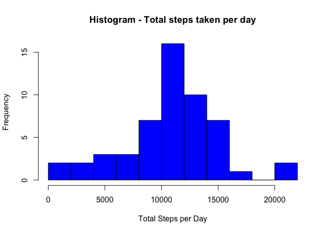

# Reproducible Research: Peer Assessment 1


## Loading and preprocessing the data

```r
activities <- read.csv("activity.csv")
activities$date = as.Date(activities$date, "%Y-%m-%d")
```

## What is mean total number of steps taken per day?

```r
stepsPerDay<-aggregate(steps~date,data=activities,sum)
hist(stepsPerDay$steps, col = "blue", xlab = "Total Steps per Day", ylab = "Frequency", 
     main = "Histogram - Total steps taken per day",breaks=10)
```

 


```r
meanSteps<-mean(stepsPerDay$steps)
medianSteps<-median(stepsPerDay$steps)
```

## What is the average daily activity pattern?

1. Make a time series plot (i.e. type = "l") of the 5-minute interval (x-axis) and the average number of steps taken, averaged across all days (y-axis)

```r
stepsPerInterval<-aggregate(steps~interval,data=activities,mean)

library(ggplot2)
library(scales)
ggplot(stepsPerInterval, aes(interval,steps)) + geom_line() 
```

 

2. Which 5-minute interval, on average across all the days in the dataset, contains the maximum number of steps?


```r
maxInterval <- with(stepsPerInterval, {
  interval[which.max(steps)]
})
```


## Imputing missing values

Note that there are a number of days/intervals where there are missing values
(coded as NA). The presence of missing days may introduce bias into some calculations 
or summaries of the data.

1. Calculate and report the total number of missing values in the dataset 
   (i.e. the total number of rows with NAs)

```r
numberOfMissing<-sum(is.na(activities$steps))
```

2. Devise a strategy for filling in all of the missing values in the dataset. 
   The strategy does not need to be sophisticated. For example, you could use the 
   mean/median for that day, or the mean for that 5-minute interval, etc.

```r
completedActivities <- activities
completedActivities[is.na(completedActivities$steps), 'steps'] <- apply(completedActivities[is.na(completedActivities$steps), ], 
                                                                        1, function(x, stepsPerInterval) {
                                                                          interval <- as.integer(x[3])
                                                                          x[1] <- stepsPerInterval[stepsPerInterval$interval == interval, 'steps']
                                                                        }, stepsPerInterval)
```

3. Create a new dataset that is equal to the original dataset but with the missing data filled in.

4. Make a histogram of the total number of steps taken each day and Calculate and report 
   the mean and median total number of steps taken per day. Do these values differ from the 
   estimates from the first part of the assignment? What is the impact of imputing missing data 
   on the estimates of the total daily number of steps?

```r
stepsPerDayCompleted<-aggregate(steps~date,data=completedActivities,sum)
hist(stepsPerDayCompleted$steps, col = "blue", xlab = "Total Steps per Day", ylab = "Frequency", 
     main = "Histogram - Total steps taken per day",breaks=10)
```

 

Calculate and report the mean and median of the total number of steps taken per day

```r
meanStepsCompleted<-mean(stepsPerDayCompleted$steps)
medianStepsCompleted<-median(stepsPerDayCompleted$steps)
```

Are there differences in activity patterns between weekdays and weekends?
For this part the weekdays() function may be of some help here. Use the dataset with the filled-in missing values for this part.


## Are there differences in activity patterns between weekdays and weekends?
1. Create a new factor variable in the dataset with two levels – “weekday” and “weekend” 
    indicating whether a given date is a weekday or weekend day.

```r
completedActivitiesWday<-completedActivities
completedActivitiesWday$wday <- as.POSIXlt(completedActivities$date)$wday
completedActivitiesWday$wday <- apply(completedActivitiesWday, 1, function(x) {
  if (x['wday'] == 0 | x['wday'] == 6) {
    x['wday'] <- "weekend"
  } else {
    x['wday'] <-"weekday"
  }
})
```

2. Make a panel plot containing a time seri<es plot (i.e. type = "l") of the 5-minute interval
    (x-axis) and the average number of steps taken, averaged across all weekday days or weekend 
    days (y-axis). See the README file in the GitHub repository to see an example of what this plot 
    should look like using simulated data.

```r
stepsPerIntervalWday<-aggregate(steps~interval+wday,data=completedActivitiesWday,mean)

ggplot(stepsPerIntervalWday, aes(interval,steps)) + geom_line() +facet_grid(wday ~ .)
```

 
